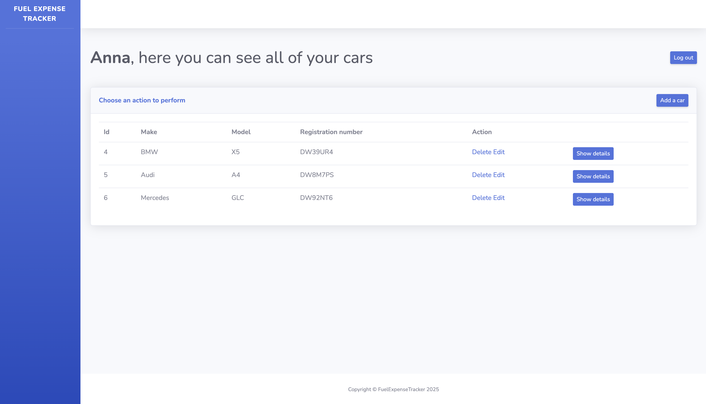
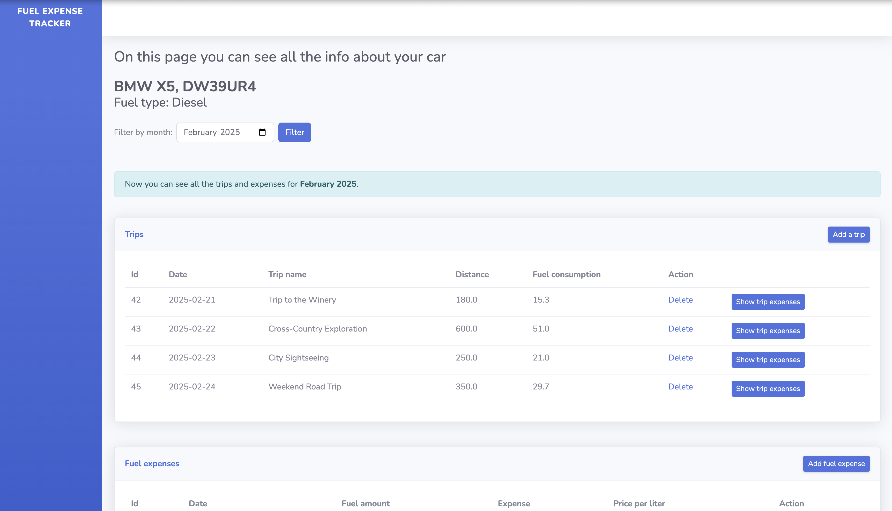
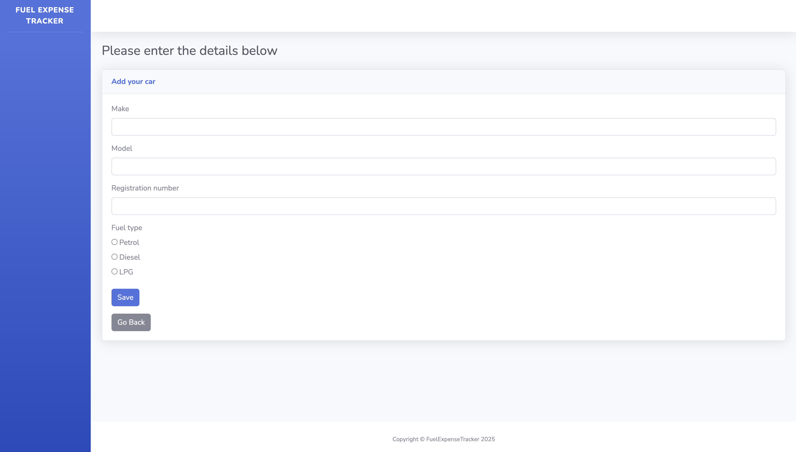
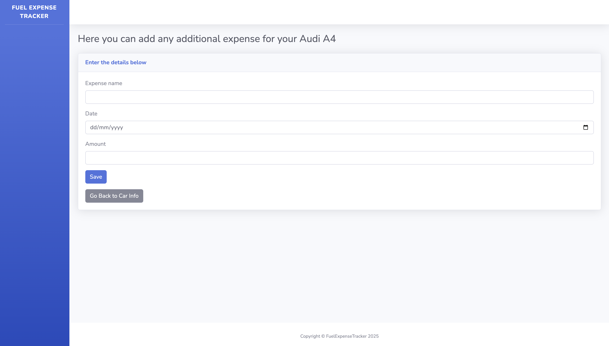
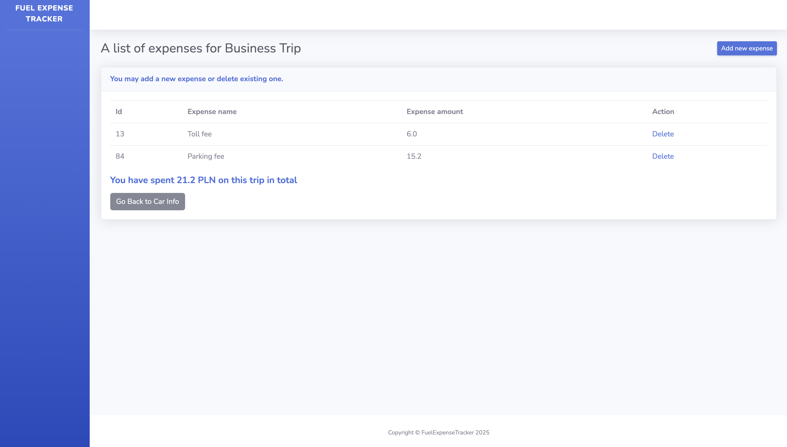

# Fuel Expense Tracker 

A web application for managing car-related expenses, trips, and user profiles.

 

### Description
This application allows users to manage their car-related expenses, log trips, and view a detailed list of expenses. Users can add, update, and delete their cars, view a summary of fuel and car expenses, and keep track of trips taken. 
Additionaly, they can also add expenses related to a particular trip.

---

### Features
- **User Management**: Allows users to register, log in, and update their profiles.
- **Car Management**: Add, update, and delete cars from the user's profile.
- **Expense Tracking**: Record and manage fuel expenses and other car-related costs.
- **Trip Logging**: Log and track trips for each car, including costs associated with each trip.
- **Data Filtering**: View expenses and trips by month.
- **Total Calculation**: Automatically calculates and displays the total costs (fuel and car expenses) for a specific month or for all time.

---

### Technologies Used

- **Backend**: 
    - Java
    - Spring Boot
    - Spring MVC
    - Spring Data JPA
    - Spring Security
    - Spring Boot DevTools
    - Spring Boot Starter Web

- **Frontend**: 
    - JSP (Java Server Pages) for rendering dynamic content on the server side
    - HTML for structuring web pages
    - CSS for styling and designing the layout of the application
    - Some JavaScript snippets (e.g., `onclick` for navigation)
    - JSTL (Jakarta Standard Tag Library) for simplifying the logic within JSP pages

- **Database**: 
    - MySQL

- **Build Tools**: 
    - Maven

- **Other**: 
    - Lombok for code generation like getters/setters
    - Jakarta Servlet
    - Tomcat for embedded server
    - Jakarta JSP

---

### Screenshots

Here are some screenshots of the application:

#### Car Management Page

#### Car Info Page

#### Car Info Page - Expenses

#### Car Add Form

#### Car Expense Add Form

#### Trip Expenses List

---

### Database Initialization

This project includes a `data.sql` file that contains sample data for initializing the database. It populates the database with some default user and car data to help with testing and development.
The `data.sql` file is placed in the `src/main/resources` directory of the project. You can manually execute the `data.sql` script against your database using your database management tool (e.g., MySQL).

#### Accessing the Application:

Once the application is running, open your browser and go to: `http://localhost:8080/start`

Two example accounts are created in the `data.sql` file for testing purposes. To log into the application, use the following credentials:

- **User 1**:  
  - **Login**: `a.nowak@example.com`  
  - **Password**: `testuser11`

- **User 2**:  
  - **Login**: `ak@example.com`  
  - **Password**: `testuser22` 

**Note:** Since the passwords are hashed (for security reasons), you will not be able to directly see or retrieve the plaintext passwords from the database. Given credentials are for testing purposes only.

---

### Used Templates

This project utilizes the **SB Admin 2** template, which is a free Bootstrap-based admin dashboard theme. It provides a clean and responsive design for the application. The template is used for styling and structuring the user interface, including the layout of the pages, navigation bars, and forms.

- **Template**: [SB Admin 2 by Start Bootstrap](https://startbootstrap.com/theme/sb-admin-2)

